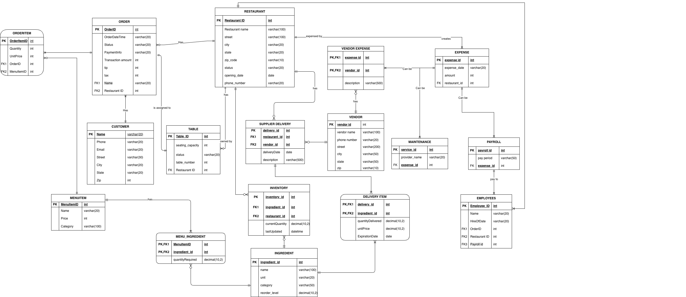

# Enterprise Restaurant Database Architecture 🍽️📊

A highly scalable, normalized Relational Database Management System (RDBMS) designed to handle complex restaurant operations, ensuring strict data integrity, automated inventory synchronization, and enterprise-grade data security.

## 🚀 Project Overview
This project simulates a real-world enterprise Operational Data Store (OLTP) capable of managing orders, multi-vendor supply chains, payroll, and customer profiles. It serves as a robust foundational data layer, optimized for subsequent ETL extraction and Data Warehouse analytics.

## 📂 Repository Structure
* `/SQL_Scripts`: Core T-SQL scripts for DDL (Table creation), DML (Mock data insertion), Security (AES_256 encryption), and PSM (Stored procedures & triggers).
* `/Documentation_and_BI`: Contains the database logical design documentation and the final Power BI business insight dashboards.

## 🛠️ Tech Stack & Database Features
* **Core Tech:** SQL Server, T-SQL, Relational Modeling (3NF)
* **Security:** AES_256 Symmetric Key Encryption, Certificate-based PII Protection
* **Performance:** Non-Clustered Indexing, Parameterized Stored Procedures
* **Analytics:** View Generation for Power BI Integration

## 📊 Architecture & Key Implementations

### 1. Database Schema (ER Diagram)
*The architecture features 17 normalized tables encompassing dynamic pricing, supply chain deliveries, and HR payroll management.*

 

### 2. Enterprise-Grade Security (`encryption_script.sql`)
Implemented robust security protocols to protect Personally Identifiable Information (PII).
* Utilized **AES_256 Symmetric Keys** bound to database certificates to encrypt sensitive customer data (Emails, Phone Numbers, Addresses) at rest.
* Designed transparent decryption views for authorized reporting modules.

### 3. Transactional Stored Procedures (`psm_script.sql`)
Engineered complex T-SQL modules to ensure ACID compliance across multi-table operations.
* **`sp_CreateOrder`**: Orchestrates concurrent inserts into `[ORDER]` and `[ORDERITEM]` tables while updating `[TABLE]` status. Utilizes `TRY...CATCH` blocks with explicit `COMMIT` and `ROLLBACK` commands to prevent data anomalies during system failures.

### 4. Automated Business Logic (`psm_script.sql`)
* **Inventory Automation Triggers**: Implemented an `AFTER INSERT` trigger on the `ORDERITEM` table. It automatically calculates ingredient consumption via a Bill of Materials (BOM) logic (`MENU_INGREDIENT` table) and recursively deducts stock from the `INVENTORY` table in real-time.

### 5. Business Intelligence Integration
Created complex SQL Views (`vw_RestaurantSalesSummary`, `vw_InventoryStatusReport`) to feed real-time data into Power BI dashboards, enabling stakeholders to monitor revenue metrics and low-stock alerts. *(See `/Documentation_and_BI` for full reports).*
